# Trip Planner

## Корпоративный сервис планирования командировок

**T-Bank 2026**

---

# О проекте

**Цель:** упростить подготовку сотрудников к командировкам, собрав всю информацию в одном месте.

**Что умеет продукт:**
- Выбор города и офиса назначения
- Корпоративный список отелей с рейтингами
- Поиск инфраструктуры рядом с офисом/отелем: кафе, рестораны, музеи, парки, достопримечательности
- Список «Хочу посетить» для каждого пользователя
- Отзывы и оценки мест
- Ролевая модель: администратор и сотрудник

---

<style scoped>
section {
  font-size: 26px;
}
section h1 {
  font-size: 44px;
}
</style>

# Технологический стек

- Java 21
- Spring Boot 3
- Spring Security + JWT
- Spring Data JPA
- PostgreSQL 17
- Spring Validation
- SpringDoc OpenAPI / Swagger
- Flyway
- JUnit 5 + Mockito
- TestContainers
- React + Vite
- React Admin
- Material UI
- Docker
- Docker Compose
- Maven

---

# Архитектура и структура

```text
.
├── frontend/              # React + Vite
│   ├── src/app/           # App, провайдеры, ролевое разделение
│   ├── src/features/      # userPlaces, userHotels, reviews, wishlist
│   ├── src/features/admin/  # CRUD городов, офисов, отелей, мест, отзывов
│   └── Dockerfile, nginx.conf
├── backend/               # Java Spring Boot
│   ├── controller/        # REST-контроллеры
│   ├── service/           # Бизнес-логика
│   ├── config/            # Security, OpenAPI, CORS
│   └── ...
├── docs/                  # OpenAPI + API docs
└── docker-compose.yml
```

---

# Ролевая модель

### Admin
- Управление городами, офисами, типами мест
- CRUD отелей и мест
- Просмотр и удаление всех отзывов

### User
- Просмотр городов, офисов, мест, отелей
- Фильтрация по расстоянию от офиса/отеля
- Личный wishlist
- Создание и редактирование своих отзывов

---

# Frontend: аутентификация

| Вход в систему | Регистрация |
|:--:|:--:|
| 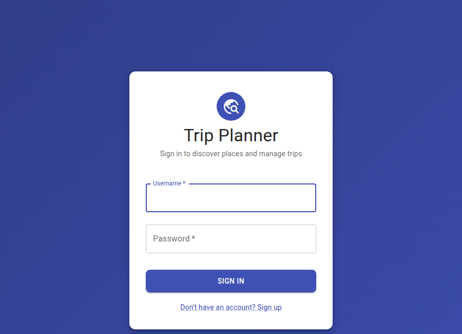 | 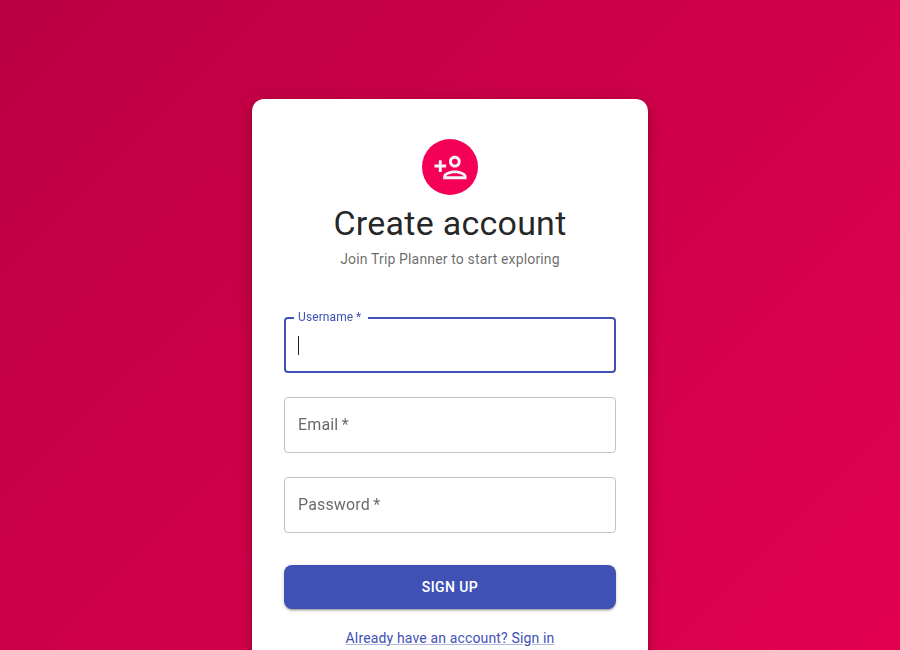 |


---

# Админка: dashboard и города

<div style="display: flex; flex-direction: column; align-items: center; gap: 18px; margin-top: 20px;">
  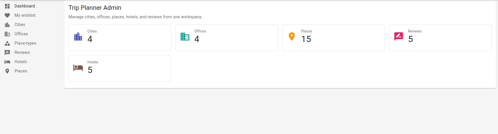
  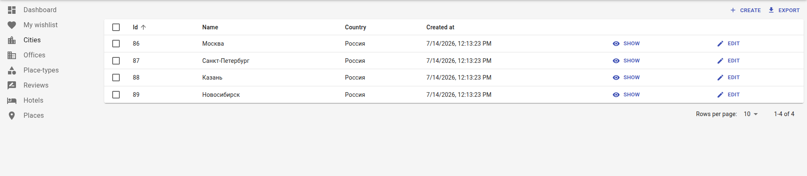
</div>

---

# Админка: отели и отзывы

<div style="display: flex; flex-direction: column; align-items: center; gap: 18px; margin-top: 20px;">
  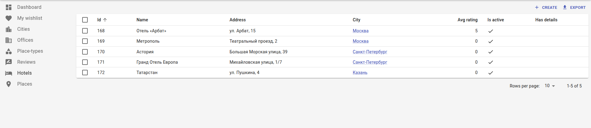
  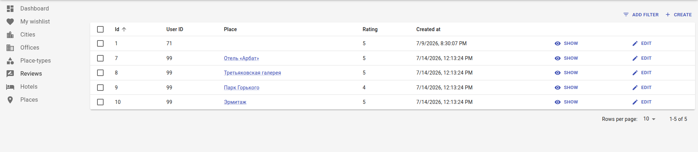
</div>

---

# Пользователь: dashboard и места

<div style="display: flex; flex-direction: column; align-items: center; gap: 18px; margin-top: 20px;">
  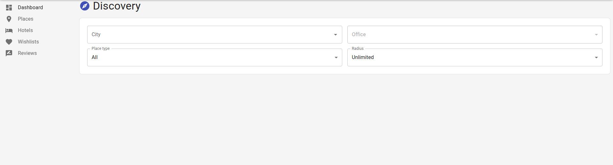
  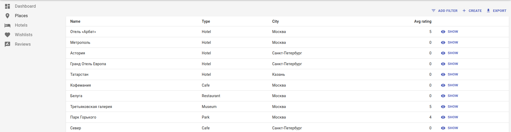
</div>

---

# Пользователь: отели, отзывы и wishlist

<div style="display: flex; flex-direction: column; align-items: center; gap: 14px; margin-top: 10px;">
  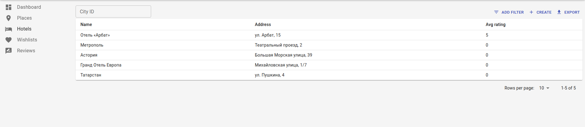
  <div style="display: flex; gap: 20px;">
    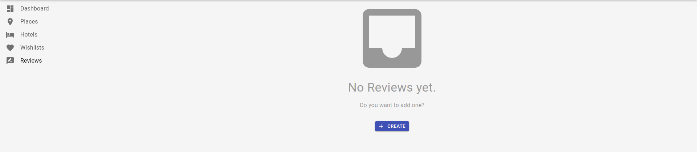
    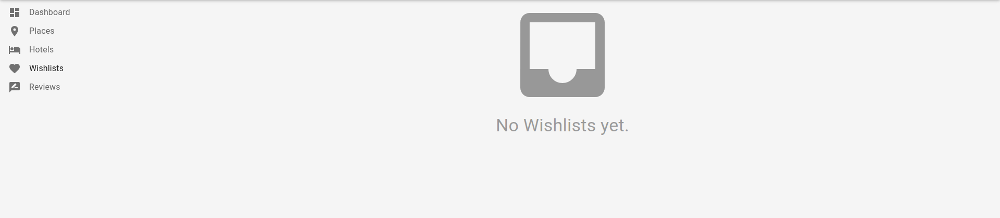
  </div>
</div>

---

# Как делали

1. Согласовали идею, scope и user stories с ментором
2. Спроектировали ER-диаграмму и REST API
3. Создали репозиторий, настроили PostgreSQL и миграции
4. Реализовали JWT-аутентификацию и CRUD-операции
5. Интегрировали frontend с backend, настроили Docker Compose
6. Добавили валидацию, обработку ошибок и Swagger-документацию
7. Объединили user и admin интерфейсы в единый frontend

---

# Результат

Получился полноценный корпоративный сервис для планирования командировок:

- Единый web-интерфейс для администраторов и сотрудников
- Полноценный REST API с JWT-защитой и ролевой моделью
- Полная Swagger-документация всех endpoint'ов
- Простой запуск всего приложения через Docker Compose

---

# Спасибо за внимание
